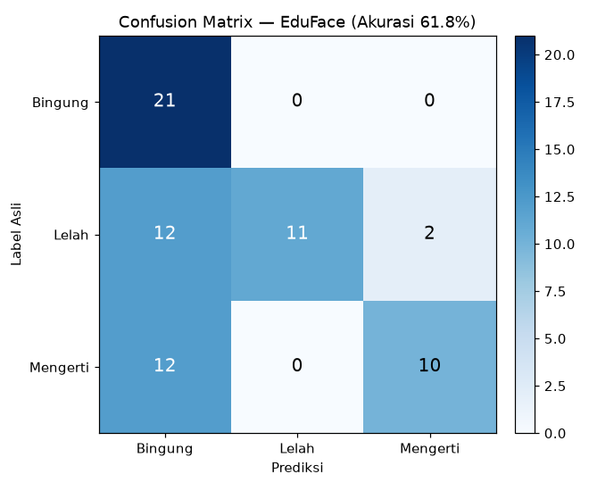

# EduFace Detector — Deteksi Ekspresi Belajar Siswa (CNN)

Aplikasi web untuk mengklasifikasikan **ekspresi belajar siswa** dari foto wajah
menggunakan model **Convolutional Neural Network (CNN) MobileNetV2** (TensorFlow/Keras),
disajikan lewat antarmuka interaktif **Streamlit**.

Aplikasi mengenali 3 kondisi belajar dan menerjemahkannya menjadi rekomendasi:

| Prediksi | Status |
|----------|--------|
| Mengerti | **Siap Belajar** |
| Lelah    | **Butuh Istirahat** |
| Bingung  | **Butuh Penjelasan Ulang** |

## Fitur
- Upload foto wajah dan dapatkan prediksi ekspresi belajar secara real-time.
- Menampilkan **tingkat keyakinan (confidence)** dan **distribusi probabilitas** tiap kelas.
- Antarmuka web sederhana berbasis Streamlit.

## Teknologi
- Python
- TensorFlow / Keras (arsitektur **MobileNetV2**, input 224×224)
- Streamlit (antarmuka web)
- NumPy, Pillow

## Cara Menjalankan
```bash
git clone https://github.com/mine2710/Deteksi-Ekspresi-Wajah.git
cd Deteksi-Ekspresi-Wajah
pip install -r requirements.txt
streamlit run app.py
```
Aplikasi akan terbuka di browser (default: http://localhost:8501).

## Struktur Proyek
```
Deteksi-Ekspresi-Wajah/
├── app.py               # Aplikasi Streamlit + logika inferensi
├── train_model.py       # Skrip augmentasi + pelatihan CNN (MobileNetV2)
├── model_cnn_tubes.h5   # Model CNN terlatih
├── requirements.txt     # Dependency (streamlit, tensorflow-cpu, numpy, Pillow)
├── images/              # Confusion matrix hasil evaluasi
└── README.md
```

## Cara Kerja Singkat
1. Foto diunggah lalu di-resize ke 224×224 dan dinormalisasi.
2. Model MobileNetV2 memprediksi probabilitas 3 kelas (Bingung, Lelah, Mengerti).
3. Kelas dengan probabilitas tertinggi ditampilkan beserta confidence dan rekomendasi status.

## Dataset & Pelatihan
- **Dataset:** 68 citra wajah primer (dikumpulkan sendiri) dalam 3 kelas —
  Bingung (21), Lelah/Ngantuk (25), Mengerti/Paham (22).
- **Augmentasi data:** tiap gambar diperbanyak ~5× (rotasi, shift, shear, zoom, flip
  horizontal) menggunakan `ImageDataGenerator` untuk memperbesar variasi data latih.
- **Arsitektur (transfer learning):**
  `MobileNetV2` (bobot ImageNet, base dibekukan) → `GlobalAveragePooling2D`
  → `Dense(128, ReLU)` → `Dropout(0.2)` → `Dense(3, Softmax)`.
- **Konfigurasi:** input 224×224, normalisasi `1/255`, optimizer Adam (lr=0.0001),
  loss `categorical_crossentropy`, 20 epoch, split latih/validasi 80/20.
- Skrip pelatihan lengkap: `tugas_besar_deep_learning_cnn.py`.

## Hasil Evaluasi
Model dievaluasi ulang pada **68 citra dataset asli** (tanpa augmentasi):

- **Akurasi keseluruhan: 61,8%** (42 dari 68 benar).

| Kelas | Precision | Recall | F1-score |
|---|---:|---:|---:|
| Bingung | 0.47 | 1.00 | 0.64 |
| Lelah | 1.00 | 0.44 | 0.61 |
| Mengerti | 0.83 | 0.46 | 0.59 |



**Analisis jujur:** model mengenali "Bingung" dengan sangat baik (recall 100%) namun
cenderung salah mengklasifikasikan sebagian "Lelah" dan "Mengerti" sebagai "Bingung".
Akurasi moderat ini wajar mengingat **dataset sangat kecil (68 gambar)** dan variasi
pencahayaan/pose terbatas. Peluang perbaikan: menambah jumlah & keberagaman data,
fine-tuning sebagian layer MobileNetV2, serta class balancing.

> Aplikasi Streamlit tetap menampilkan **confidence score** dan **distribusi probabilitas**
> tiap kelas untuk transparansi prediksi ke pengguna.

## Author
**Sofyan Fauzi Dzaki Arif** — [github.com/mine2710](https://github.com/mine2710)
Proyek Tugas Besar Deep Learning — Sains Data, ITERA.
